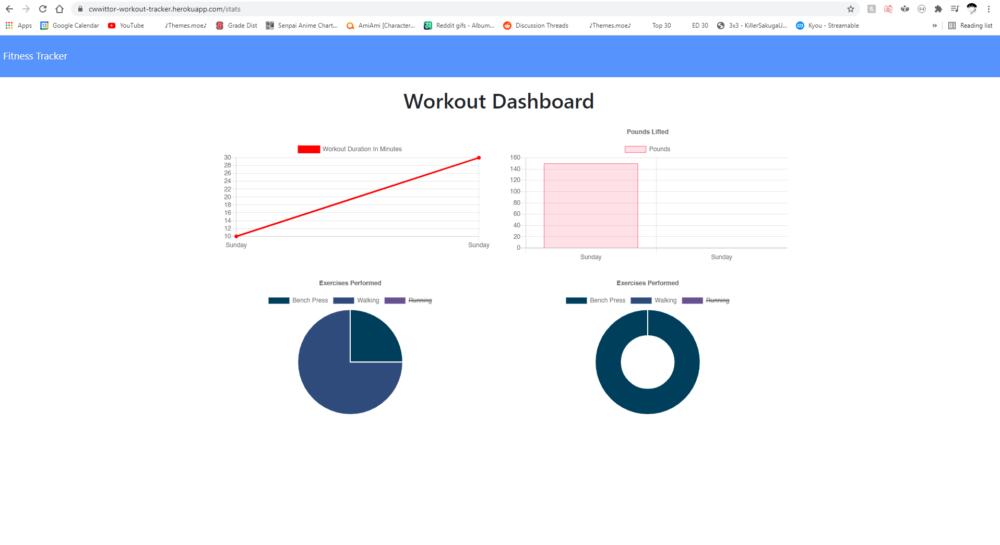

# Workout-Tracker

  ## Description

  tracks workouts of the user and outputs data based on how much is done through the time used

  ## Table of Contents
  * [Installation](#Installation)
  * [Usage](#Usage)
  * [Testing Information](#Testing_Information)
  * [Challenges/Learned Information](#Challenges/Learned_Information)
  * [Licenses](#Licenses)
  * [Screenshots](#Screenshots)
  * [Contact-Info](#Contact-Info)

  ## Installation
  npm i

  ## Usage
  npm start or use deployed heroku app

  ## Testing_Information
  npm start

  ## Challenges/Learned_Information
  This app had a lot of starter code which was nice, but it felt like it left for little to be done outside of that. I also got lazy and didn't setup routes due to being stressed for time. My largest challenge was based around getting the dates to be read.

  ## Licenses
  The license(s) used for this are the following: none

  ## Screenshots
   

  ## Contact-Info
  Email: cwwittor@ncsu.edu
  Github: cwwittor

